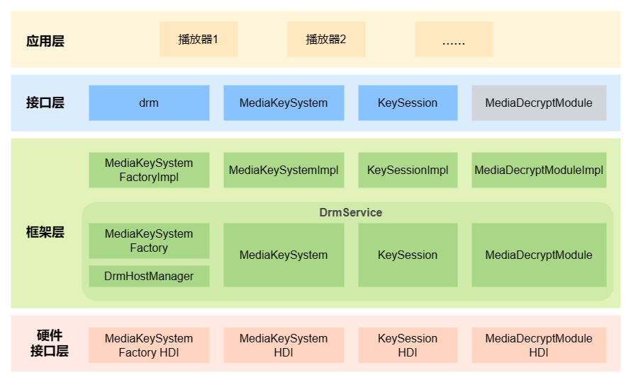

# DRM组件
## 简介
DRM（Digital Rights Management）组件支持数字版权管理相关业务的开发，开发者可以通过已开放的接口实现本组件所支持的DRM内容的证书获取、证书管理和解密等操作，以及新功能的开发。

DRM组件目前主要提供以下功能：
* 插件管理
* DRM节目授权
* DRM节目解密

## 架构


## 目录
```
/foundation/multimedia/drm_framework     # DRM组件业务代码
├── frameworks                           # 框架代码
│   ├── native                           # 内部接口实现
│   │   └── drm                          # DRM框架实现
│   └── js                               # 外部接口实现
│       └── drm_napi                     # DRM NAPI实现
├── interfaces                           # 接口代码
│   ├── inner_api                        # 内部接口
│   └── kits                             # 外部接口
├── BUILD.gn                             # 构建文件
├── bundle.json                          # 部件描述文件
├── sa_profile                           # 服务配置文件
└── services                             # 服务代码
    ├── drm_service                      # DRM服务实现
    ├── etc                              # DRM服务配置
    └── utils                            # 工具
```
## 使用说明

## 相关仓
[multimedia\_drm\_framework](https://gitee.com/openharmony-sig/multimedia_drm_framework)