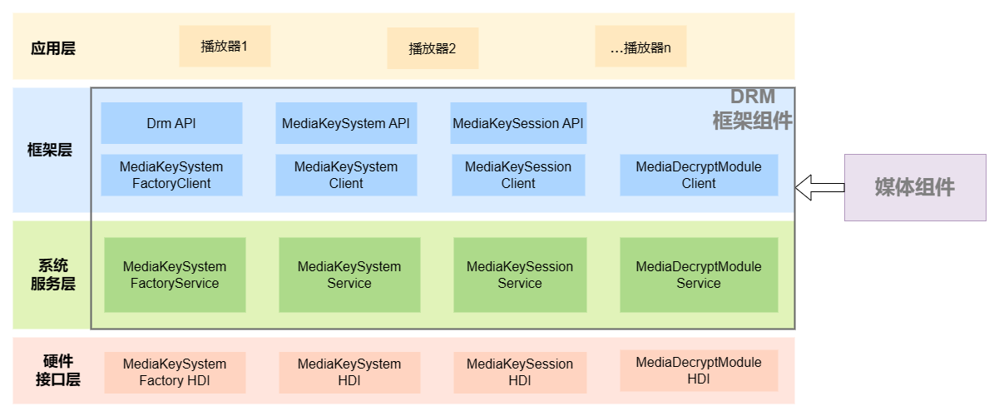

# DRM框架组件
## 简介
DRM（Digital Rights Management）框架组件支持音视频媒体业务数字版权管理功能的开发。开发者可以调用系统提供的DRM插件，完成DRM证书管理、DRM许可证管理等功能，支持DRM加密媒体数据的解密，实现DRM节目授权和解密播放。

DRM框架组件提供以下功能：
* DRM证书管理：生成证书请求、设置证书响应，实现对证书Provision(下载)功能；
* DRM许可证管理：生成许可证请求、设置许可证响应，同时实现对许可证的离线管理等功能；
* DRM节目授权：支持底层DRM插件根据许可证对DRM节目授权；
* DRM节目解密：支持媒体播放功能的解密调用，实现对DRM节目的解密和播放。

**图 1**  DRM框架组件架构图<a name=""></a>


## 模块介绍

| 模块名称 | 功能 |
| ------- | ----|
| MediaKeySystemFactoryClient | 对外提供Drm API接口，调用MediaKeySystemFactoryService，用于判断对DRM方案的支持及创建MediaKeySystem实例等。 |
| MediaKeySystemFactoryService | 通过MediaKeySystemFactory HDI调用底层插件，提供判断对DRM方案的支持及创建MediaKeySystem实例的功能。 |
| MediaKeySystemClient |  对外提供MediaKeySystem API接口，调用MediaKeySystemService，用于DRM证书Provision（下载）、创建MediaKeySession、获取/设置属性等。 |
| MediaKeySystemService | 通过MediaKeySystem HDI调用底层插件，提供DRM证书Provision（下载）、创建MediaKeySession、获取/设置属性等功能。|
| MediaKeySessionClient |  对外提供MediaKeySession API接口，调用MediaKeySessionService，用于生成许可证请求、设置许可证响应及许可证管理等。 |
| MediaKeySessionService | 通过MediaKeySession HDI调用底层插件，提供生成许可证请求、设置许可证响应及许可证管理等功能。 |
| MediaDecryptModuleClient | 调用MediaDecryptModuleService，为媒体组件提供媒体数据解密功能。|
| MediaDecryptModuleService | 通过MediaDecryptModule HDI调用底层插件，提供解密功能。|

## 目录
```
/foundation/multimedia/drm_framework     # DRM框架组件业务代码
├── frameworks                           # 框架代码
│   ├── native                           # 内部接口实现
│   │   └── drm                          # DRM框架实现
│   └── js                               # 外部接口实现
│       └── drm_napi                     # DRM NAPI实现
├── interfaces                           # 接口代码
│   ├── inner_api                        # 内部接口
│   └── kits                             # 外部接口
├── BUILD.gn                             # 构建文件
├── bundle.json                          # 部件描述文件
├── sa_profile                           # 服务配置文件
└── services                             # 服务代码
    ├── drm_service                      # DRM服务实现
    ├── etc                              # DRM服务配置
    └── utils                            # 工具
```
## 编译
~~~shell
./build.sh --product-name {product name} --ccache --build-target drm_framework
~~~
{product_name}为当前支持的平台，比如rk3568。
## 使用说明
可参考以下示例：

1.引入drm模块
~~~js
import drm from  '@ohos.multimedia.drm';
~~~
2.判断DRM框架是否支持指定的DRM方案, 示例以'com.clearplay.drm'为例。
~~~js
var isSupported = drm.isMediaKeySystemSupported('com.clearplay.drm');
~~~
3.创建MediaKeySystem实例, 
~~~js
var keySystem = drm.createMediaKeySystem('com.clearplay.drm');
~~~
4.如无本地DRM证书，需完成证书下载。
~~~js
// 生成证书请求
var drmRequest = keySystem.generateKeySystemRequest();
// 获取证书响应
var response = ...
// 处理证书响应
keySystem.processKeySystemResponse(response);
~~~
5.创建MediaKeySession示例，传入安全等级。
~~~js
var keySession = keySystem.createKeySession(drm.ContentProtectionLevel.CONTENT_PROTECTION_LEVEL_SW_CRYPTO);
~~~
6.生成许可证请求。
~~~js
var mediaKeyType:number = 1; // 在线申请
var initData = ...;
keySession.generateMediaKeyRequest('video/avc', initData, mediaKeyType);
~~~
7.向DRM服务端发送许可证请求，获取许可证响应，并将许可证响应设置到keySession中。
~~~js
keySession.processMediaKeyResponse(mediaKeyResponse);
~~~
8.获取SVP(Secure Video Path，安全视频通路)属性。
~~~js
var svp:boolean = keySession.requireSecureDecoderModule('video/mp4');
~~~
9.将keySession与SVP属性设置到媒体组件中，以实现解密播放。

## 相关仓
[multimedia\_drm\_framework](https://gitee.com/openharmony/multimedia_drm_framework)
